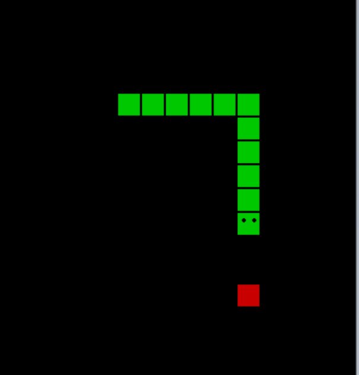

# Snake-game
Snake game that allows the player to control a single block, which grows in length when it eats an apple, by turning only left or right by 90º.
This is a basic implementation of Snake game written in Python using [pygame](https://www.pygame.org/news) and [tkinter](https://docs.python.org/3/library/tkinter.html).

# Rules
1. The game is over when the snake bumps into one of the edges of the screen or accidently eat himself.
2. Use your cursor keys: up, left, right, and down.
3. Higher (and faster) play levels award more points.

  

